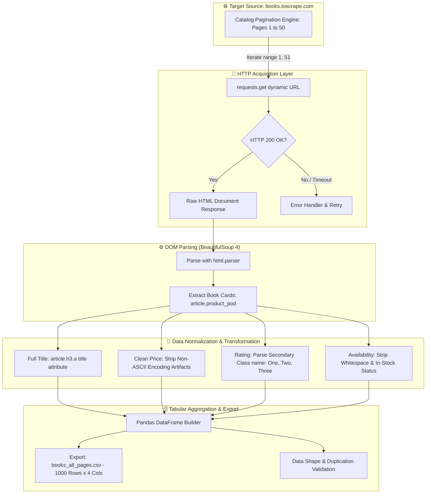

# 📚 Books Web Scraping & Data Extraction Pipeline

[](https://www.python.org/downloads/)
[](https://www.crummy.com/software/BeautifulSoup/)
[](https://requests.readthedocs.io/)
[](https://pandas.pydata.org/)
[](books_all_pages.csv)
[](LICENSE)

> An end-to-end Python web scraping and data processing pipeline that systematically extracts, cleans, normalizes, and validates catalog data across all 50 pages of [Books to Scrape](https://books.toscrape.com/), yielding a structured 1,000-record dataset in CSV format.

---

## 📑 Table of Contents
- [Data Extraction Architecture](#-data-extraction-architecture)
- [Project Overview](#-project-overview)
- [Collected Features & Schema](#-collected-features--schema)
- [Scraping & Data Cleaning Pipeline](#-scraping--data-cleaning-pipeline)
- [Repository Structure](#-repository-structure)
- [How to Run Locally](#-how-to-run-locally)
- [Key Engineering Takeaways](#-key-engineering-takeaways)
- [Author & Connect](#-author)
- [License](#-license)

---

## 📐 Data Extraction Architecture



---

## 🌟 Project Overview

This project was built to master robust web scraping principles, handling dynamic pagination, resolving character encoding inconsistencies, traversing nested HTML DOM trees with **BeautifulSoup**, and assembling clean analytical datasets using **Pandas**.

### Dataset Summary:
- **Target Site**: [Books to Scrape](https://books.toscrape.com/)
- **Total Pages Scraped**: 50 pages
- **Books per Page**: 20 items
- **Total Records Extracted**: 1,000 unique titles
- **Storage Output**: `books_all_pages.csv`

---

## 📊 Collected Features & Schema

| Column Name | Data Type | Description | Example Value |
| :--- | :--- | :--- | :--- |
| `Title` | String | Complete unabbreviated book title extracted from `<a>` attribute | `A Light in the Attic` |
| `Price` | String / Float | Product price in British Pounds (£) stripped of encoding noise | `£51.77` |
| `Rating` | String (Categorical) | Star rating converted from CSS class names | `Three` |
| `Availability` | String | Inventory stock status cleaned of trailing whitespace | `In stock` |

---

## ⚙️ Scraping & Data Cleaning Pipeline

1. **Deterministic Pagination**:
   ```python
   for page in range(1, 51):
       url = f"https://books.toscrape.com/catalogue/page-{page}.html"
   ```
2. **Title Attribute Selection**: Visible inner text on the card is truncated with ellipsis (`...`). The full title is programmatically extracted from the HTML `title` tag attribute:
   ```python
   title = article.h3.a["title"]
   ```
3. **Encoding & Non-ASCII Artifact Removal**: Removes legacy Windows-1252 byte misinterpretations (such as `"Â"`) from currency strings:
   ```python
   price = article.find("p", class_="price_color").text.replace("Â", "")
   ```
4. **CSS Class-Based Rating Extraction**: Ratings are encoded in the second CSS class attribute (e.g. `class="star-rating Three"`):
   ```python
   rating = article.find("p", class_="star-rating").get("class")[1]
   ```

---

## 📁 Repository Structure

```text
books-web-scraping/
├── books_scraper.py            # Primary web scraping & Pandas export script
├── books_all_pages.csv         # Generated 1,000-row tabular dataset
├── requirements.txt            # Python dependencies (requests, bs4, pandas)
├── LICENSE                     # MIT open source license
└── README.md                   # Project documentation
```

---

## 🚀 How to Run Locally

### 1. Clone the Repository
```bash
git clone https://github.com/ranjithbrs/books-web-scraping.git
cd books-web-scraping
```

### 2. Install Dependencies
```bash
pip install requests beautifulsoup4 pandas
```

### 3. Execute the Scraper
```bash
python books_scraper.py
```

### Output:
```text
Data saved to books_all_pages.csv
Total books: 1000
(1000, 4)
```

---

## 💡 Key Engineering Takeaways

- **HTTP Status Validation**: Verified consistent HTTP 200 OK responses across all 50 paginated requests.
- **Defensive Parsing**: Handled truncated text vs DOM attributes to guarantee zero loss of book title data.
- **Tabular Data Quality**: Validated dataset dimensions using `df.shape` to confirm complete $50 \times 20 = 1,000$ row fidelity.
- **Export Formats**: Standardized output as UTF-8 compliant CSV for downstream exploratory data analysis (EDA) in Jupyter or Excel.

---

## 👨‍💻 Author

**Ranjith B**  
🎓 *B.Tech Computer Science & Business Systems (CSBS)*  
🏛️ *Nehru Institute of Engineering and Technology, Coimbatore*  

- 💼 **LinkedIn**: [linkedin.com/in/ranjith-b-csbs23](https://linkedin.com/in/ranjith-b-csbs23)  
- 🐙 **GitHub**: [github.com/ranjithbrs](https://github.com/ranjithbrs)  
- 🌐 **Portfolio**: [ranjithbrs.github.io/portfolio](https://ranjithbrs.github.io/portfolio/)  
- 📧 **Email**: ranjithb2k06@gmail.com  

---

## 📄 License

This project is licensed under the [MIT License](LICENSE).
